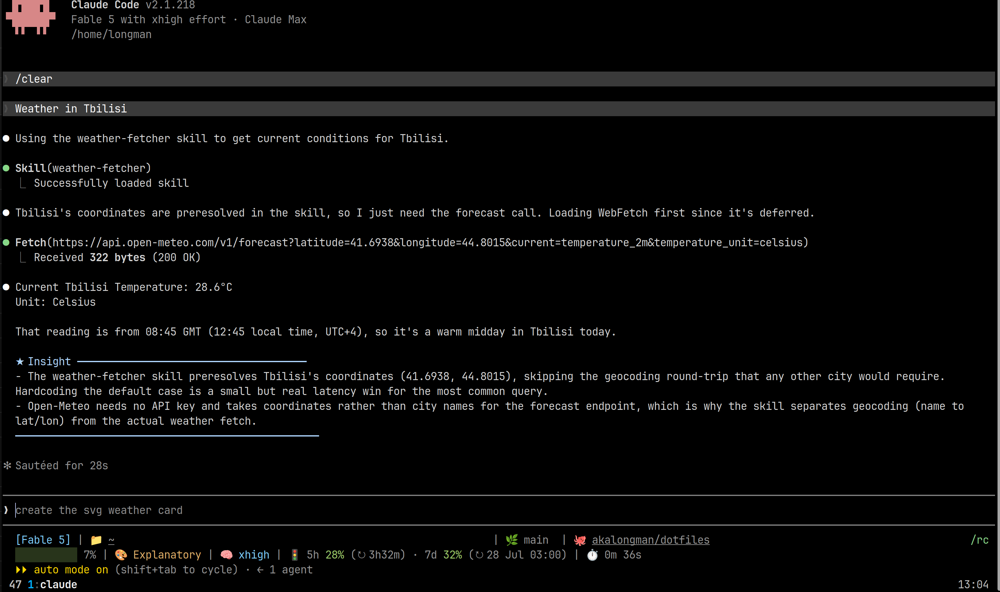

# Dotfiles

Personal dotfiles, Linux first. Tracks shell (bash), tmux, vim, git, starship, Sublime Text, Zed, and Claude Code configuration. Managed with [yadm](https://yadm.io), which tracks `$HOME` as a git working tree directly. No symlink layer, no installer.



Highlights:

* bash with a starship prompt, tmux autostart, and a modern CLI toolchain (fzf, ripgrep, fd, bat, eza, zoxide, direnv) installed by the bootstrap.
* The whole Claude Code setup: global `CLAUDE.md`, rule files, skills, agents, hooks, and a custom statusline.
* Sublime Text and Zed configuration, SSH-signed commits.

## Install

### Ubuntu / Debian

```
sudo apt install yadm
yadm clone https://github.com/akalongman/dotfiles.git
yadm bootstrap
```

Older Ubuntu without `yadm` in apt: install it from the upstream instructions at https://yadm.io/docs/install first.

### Other Linux

Install yadm with your package manager or from https://yadm.io/docs/install (it is a single script), then run the same `yadm clone` and `yadm bootstrap` pair.

### macOS

```
brew install yadm
yadm clone https://github.com/akalongman/dotfiles.git
yadm bootstrap
```

The bootstrap installs the toolchain with Homebrew when apt is absent, and Linux-only steps (GNOME Terminal theme, apt repos) skip themselves. The shell files already branch on `uname` where platforms differ (clipboard, `open` vs `xdg-open`).

### Windows

Use WSL with an Ubuntu distro and follow the Ubuntu steps inside it. A native PowerShell setup is not supported: everything here is bash and POSIX sh and expects a Unix `$HOME`.

### What bootstrap does

`yadm clone` populates `$HOME` from this repo. `yadm bootstrap` then sets the machine up: it installs the CLI toolchain the dotfiles expect (tmux, fzf, ripgrep, fd, bat, eza, zoxide, direnv, and friends) via apt or Homebrew, installs glow (the terminal markdown reader used by the `spec()` function; from Charm's apt repo on Ubuntu, from Homebrew on macOS), clones TPM for tmux plugins, re-applies the GNOME Terminal theme, rebuilds the bat theme cache, and finally prints the remaining manual follow-ups (Claude Code re-auth, private repository clone, starship). Re-running `yadm bootstrap` is safe; every step is idempotent.

## Why yadm

The previous setup used a `home/` subdirectory in the repo and a hand-written `install.sh` that symlinked files into `$HOME`. yadm replaces both: the repo's working tree IS `$HOME` (via a bare repo under `~/.local/share/yadm/repo.git`), so files live at their natural paths with no symlink layer. New files added under tracked directories like `~/.claude/skills/` are picked up automatically by `yadm status` without any allowlist trick. yadm's per-host alternate-file support (`<file>##os.Linux`, `<file>##hostname.<host>`) is available the day a second machine appears, with no extra setup required.

## Layout

```
$HOME/                    yadm working tree
├── .bashrc               Interactive shell init.
├── .profile              Login shell init (also loaded by graphical session).
├── .bash_logout          Console clear on shell exit.
├── .inputrc              Readline behavior.
├── .vimrc                Vim configuration.
├── .gitconfig            Git user, signing, credential helper, pull strategy (merge).
├── .exports              Canonical exports. PATH, EDITOR, NVM_DIR, ANDROID_HOME, etc.
├── .aliases              Shell aliases (sourced by .bashrc).
├── .functions            Shell functions (sourced by .bashrc), including the spec() markdown picker.
├── .editorconfig         Editor whitespace/indent baseline.
├── .gitignore            Tracked by yadm itself; see comment at top of file.
├── .tmux.conf            tmux config: truecolor, vi copy mode, resurrect/continuum, spec popup.
├── .tmux-cheatsheet.md   Quick reference for the tmux setup and custom bindings.
├── README.md             This file.
├── bin/                  Utility scripts, see "How ~/bin works" below.
├── .claude/              Claude Code configuration.
│   ├── CLAUDE.md         Global instructions.
│   ├── settings.json
│   ├── mcp.json
│   ├── statusline.sh
│   ├── rules/            Per-language rule files referenced from CLAUDE.md.
│   ├── agents/           User defined agents.
│   ├── skills/           User defined skills.
│   └── hooks/            Hook scripts and notification sounds.
├── .config/
│   ├── bat/              bat config plus Tokyo Night theme (cache rebuilt by bootstrap).
│   ├── composer/         Global composer.json and composer.lock.
│   ├── fastfetch/        System info banner config.
│   ├── git/              allowed_signers for SSH commit signing, global ignore.
│   ├── htop/htoprc
│   ├── starship.toml     Prompt configuration.
│   ├── sublime-text/Packages/User/   Sublime Text user customizations.
│   ├── zed/              Zed settings, keymap, and theme.
│   └── yadm/bootstrap    Setup script run by `yadm bootstrap` after clone (see Install).
├── .gemini/settings.json
├── .github/              README assets.
└── .local/share/openspec/schemas/   User-level OpenSpec workflow schemas, shared across all projects.
```

`~/.local/share/yadm/repo.git/` is yadm's bare repo. Do not touch it directly; use `yadm` commands.

## Daily usage

The pieces of this setup that earn their keep every day:

| Command | What it does |
|---|---|
| `spec` (or `Ctrl-b S` in tmux) | Fuzzy-pick a markdown doc in the current project and read it rendered in glow |
| `later "check the failing seeder"` | Park a follow-up note in the project's `NOTES.local.md`; bare `later` lists the queue. Claude Code resurfaces a settled queue via its Stop hook |
| `worktree create <name>` / `remove` / `list` / `doctor` | Project-agnostic git worktree orchestrator with provisioning hooks |
| `commit` | Stage everything and commit; with no message argument, Claude writes the one-liner from the diff |
| `p` / `pf <filter>` | Run the project's test suite (Pest or PHPUnit, auto-detected) |
| `a ...` | `php artisan ...` |
| `db list\|create\|drop\|refresh <name>` | Local MySQL database helpers (the destructive ones ask first) |
| `c` / `cy` | `claude` / `claude --dangerously-skip-permissions` |
| `nah` | `git reset --hard` plus `git clean -df` |

tmux starts automatically in local terminals (`NO_TMUX=1` opts out). The three bindings worth memorizing: `Ctrl-b d` detaches while the work keeps running, `Ctrl-b S` opens the spec picker popup, and `F12` hands the keyboard to a nested remote tmux. Sessions survive reboots via resurrect/continuum. The full reference, including copy-mode and clipboard details, lives in [`.tmux-cheatsheet.md`](.tmux-cheatsheet.md).

`ls`, `cat`, and `top` transparently become eza, bat, and bottom when those are installed; the plain tools remain when absent.

## What is not here

Anything private lives in a separate private repository. Its link script symlinks the private files into place on a new machine; this repository carries no trace of them, not even the symlinks. See "How `~/bin` works" below for the mechanism.

## How `.exports` works

The `.exports` file is sourced by both `.profile` (at graphical login, in `/bin/sh`) and `.bashrc` (per terminal, in bash). Two consequences:

1. Variables defined in `.exports` are visible to both GUI launched apps (Android Studio, IDE shortcuts from the desktop launcher) and terminal sessions.
2. `.exports` must stay POSIX compatible. No `$'...'` ANSI quoting, no `[[ ]]`, no bash arrays. The included `__prepend_path` and `__append_path` helpers are idempotent, so the file is safe to source more than once.

`GPG_TTY` is intentionally NOT in `.exports`. It needs `$(tty)` re-evaluated per shell, so it lives in `.bashrc`.

## Scope

Linux first; daily driven on Ubuntu. macOS works on a best-effort basis: the shell files branch on `uname` where behavior differs, and Linux-only pieces (GNOME theming, PulseAudio sound helpers, the Android SDK path at `/opt/google/android/sdk`, JMeter at `/opt/apache-jmeter/bin`) degrade to no-ops or stay unused. Windows is covered through WSL only. If a second machine is added, yadm's `##os.*` / `##hostname.*` alternates can override machine specifics without conditional logic in `.exports`.

## How `~/bin` works

`~/bin/` holds the public utility scripts (`disable-kvm`, `power-*`, `listppa`, `gsettings-iterate-all`, `empty-trash`, `elk-*`, `gnome-terminal-tokyonight.sh`, `later`, `worktree`) as regular tracked files; the `.gitignore` allowlists them by name.

Private scripts also live in `~/bin/` at runtime, but only as symlinks created by the private repository's link script; neither the scripts nor the symlinks are tracked here. The same applies to a few private Sublime Text, Claude Code, and opencode files. After cloning the private repository and running its link script, everything appears in place; until then `~/bin/` simply holds the public scripts. The split keeps private material out of this repository while keeping the canonical bin directory at `~/bin/` for muscle memory and PATH simplicity.

## Forking

Do not run `yadm clone` on someone else's dotfiles until you have reviewed every tracked file. Dotfiles encode personal preference. Useful pieces should be copied, not inherited wholesale.
